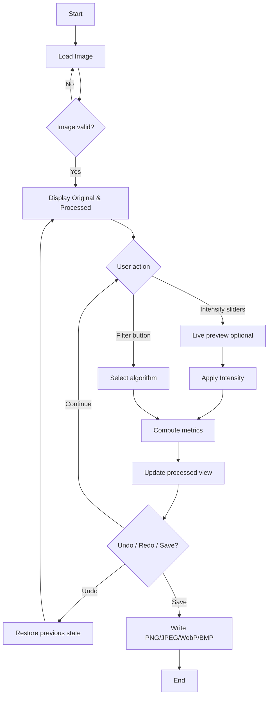

# Smart Image Enhancement Studio
## Spatial Domain Image Processing — IPV Project Report

---

> **Formatting note (for Word export):** Times New Roman, 12 pt body, 14 pt headings, 1.5 line spacing, page numbers, captioned figures. Replace bracketed placeholders on the cover page before submission.

---

## 1. Cover Page

| Field | Details |
|-------|---------|
| **Project Title** | Smart Image Enhancement Studio — A Spatial Domain Image Processing Application |
| **Course Title** | Image Processing and Vision (IPV) / Digital Image Processing (DIP) |
| **Student Name** | [Your Full Name] |
| **Roll Number** | [Your Roll No.] |
| **Semester** | [e.g., 6th Semester] |
| **Department** | [e.g., Computer Science and Engineering] |
| **College** | [Your College Name] |
| **Academic Year** | [e.g., 2025–2026] |
| **Guide Name** | [Faculty Guide Name] |
| **Submission Date** | [Date] |

---

## 2. Abstract

Digital images captured under poor lighting or sensor noise often suffer from low contrast, blur, and colour imbalance. Manual correction in general-purpose editors requires expertise and does not demonstrate core **spatial domain** techniques taught in Image Processing and Vision (IPV) courses.

**Problem:** There is a need for an educational, interactive tool that applies classical spatial filters—intensity transforms, histogram methods, convolution-based smoothing/sharpening, and edge operators—with immediate visual feedback and quantitative evaluation.

**Method:** We designed and implemented **Smart Image Enhancement Studio**, a desktop application in **Python** using **OpenCV**, **NumPy**, **Tkinter**, **Pillow**, and **Matplotlib**. The system follows a modular pipeline: load BGR image → apply selected spatial operation(s) → compute **PSNR**, **SSIM**, and statistical metrics vs. the original → display side-by-side comparison and export results.

**Key Results:** On a standard synthetic test image, **CLAHE** achieved PSNR 27.58 dB and SSIM 0.78 versus the original; **unsharp masking** preserved structure (SSIM 0.83) while improving perceived sharpness; edge operators (Canny, Sobel) produced expected high-frequency outputs (low SSIM, by design). The GUI supports 16+ operations, undo/redo, and filter chaining.

**Applications:** DIP/IPV laboratory demonstrations, photo enhancement prototyping, forensic and medical imaging preprocessing (under supervision), and introductory computer vision pipelines before frequency-domain or deep-learning stages.

---

## 3. Introduction

### 3.1 Background

**Image enhancement** refers to improving the visual quality or interpretability of an image without assuming a degradation model. In the **spatial domain**, each output pixel is a function of pixels in a neighbourhood of the corresponding input pixel—implemented via point operations (intensity transforms) or mask operations (convolution).

Classical techniques include:

- **Intensity transformations:** \( g(x,y) = T[f(x,y)] \) — brightness, contrast, gamma correction.
- **Histogram processing:** global equalization and adaptive CLAHE for contrast expansion.
- **Spatial filtering:** averaging/Gaussian smoothing, median filtering, bilateral filtering, Laplacian sharpening, unsharp masking.
- **Edge detection:** gradient-based (Sobel) and optimal edge detectors (Canny).

These form the foundation of IPV curricula and precede frequency-domain (FFT) and transform-domain methods (DCT, wavelets).

### 3.2 Motivation and Relevance

Students often implement algorithms in isolated scripts without an integrated workflow. A unified GUI:

1. Reinforces the relationship between **algorithm parameters** and **visual results**.
2. Enables **before/after comparison** required in project evaluation.
3. Supports **quantitative metrics** (PSNR, SSIM) mandated in rubrics.
4. Demonstrates professional software structure (modules, state management, documentation).

The project aligns with industry practice where OpenCV-based pipelines preprocess images before detection, segmentation, or recognition.

### 3.3 Objectives

| # | Objective |
|---|-----------|
| O1 | Develop a working desktop application for spatial domain enhancement using Python and OpenCV. |
| O2 | Implement intensity transforms, histogram methods, smoothing, sharpening, colour mappings, geometry ops, and edge/threshold analysis. |
| O3 | Provide side-by-side visualization, RGB histograms, and export in standard formats. |
| O4 | Evaluate outputs using MSE, PSNR, SSIM, and statistical interpretation. |
| O5 | Compare spatial enhancement techniques objectively using quality metrics and visual analysis to identify suitable operations for different image conditions. |

---

## 4. Literature Review

### 4.1 Related Works

| Work | Approach | Strength | Limitation |
|------|----------|----------|------------|
| **Gonzalez & Woods, *Digital Image Processing*** | Theoretical foundation for spatial/frequency techniques | Authoritative; used in academia | Not an interactive tool |
| **OpenCV Documentation** | Production library for `cv2.equalizeHist`, `createCLAHE`, `filter2D` | Fast, widely adopted | Low-level; no pedagogy UI |
| **Adobe Lightroom / GIMP** | Commercial/open photo editors | Rich UX | Black-box; weak DIP learning linkage |
| **MATLAB Image Processing Toolbox** | GUI (`imtool`) + scripting | Strong for labs | Proprietary; licensing cost |

### 4.2 Comparison with Existing Approaches

Unlike general editors, this project **explicitly maps each UI control to a named DIP algorithm** with documented equations. Unlike single-script homework, it offers **undo/redo**, **apply-from-original vs. chained processing**, and **embedded metrics**.

### 4.3 Research Gap

Few lightweight **open-source educational tools** combine: (a) breadth of spatial operators, (b) real-time comparison, (c) quantitative evaluation, and (d) modular Python codebase suitable for viva walkthrough—motivating Smart Image Enhancement Studio.

---

## 5. Methodology & Technical Approach

### 5.1 System Workflow

The end-to-end process:

1. **Input:** User loads JPG/PNG/BMP/TIFF/WebP via GUI or `Ctrl+O`.
2. **Representation:** Image stored as NumPy `uint8` array in **BGR** order (OpenCV convention).
3. **Source selection:** Operation reads either **original** or **current processed** buffer (for chaining).
4. **Processing:** Selected algorithm from `ImageProcessor` class applied.
5. **State update:** Result committed to document; prior state pushed to undo stack (max 30).
6. **Evaluation:** PSNR, SSIM, MSE, mean μ, std σ computed vs. original.
7. **Output:** Processed view refreshed; optional histogram plot; save to disk.

**Figure 5.1** — See `Research/output/figures/system_pipeline.png` (generated pipeline diagram).

### 5.2 Flowchart (Mermaid)



### 5.3 Algorithms (Detailed)

#### 5.3.1 Brightness and Contrast

Linear transform via OpenCV `convertScaleAbs`:

\[
g(x,y) = \alpha \cdot f(x,y) + \beta
\]

- \(\alpha \in [0.1, 3.0]\) — contrast scale (slider 10–300 %)
- \(\beta \in [-100, 100]\) — brightness offset

#### 5.3.2 Gamma Correction

Look-up table: \( s = c \cdot r^\gamma \), normalized to 8-bit, applied per channel via `cv2.LUT`.

#### 5.3.3 Saturation

Convert BGR→HSV; scale **S** channel by factor \(s \in [0, 2]\); convert back.

#### 5.3.4 Histogram Equalization

Convert to **YCrCb**; apply `cv2.equalizeHist` on **Y** only to avoid colour shift; convert back to BGR.

#### 5.3.5 CLAHE

Contrast Limited Adaptive Histogram Equalization on luminance:

\[
\text{clipLimit} = 2.0,\quad \text{tileGridSize} = (8 \times 8)
\]

Reduces over-amplification of noise vs. global EQ.

#### 5.3.6 Gaussian Blur

Convolution with Gaussian kernel \(G(x,y)\), kernel size user-selectable (odd, 3–21):

\[
G(x,y) = \frac{1}{2\pi\sigma^2} \exp\left(-\frac{x^2+y^2}{2\sigma^2}\right)
\]

#### 5.3.7 Median Filter

Non-linear order-statistic filter; effective for salt-and-pepper noise.

#### 5.3.8 Bilateral Filter

Preserves edges by combining domain and range Gaussian weights; \(d=9\), \(\sigma=75\).

#### 5.3.9 Laplacian Sharpening

\[
K = \begin{bmatrix} 0 & -1 & 0 \\ -1 & 5 & -1 \\ 0 & -1 & 0 \end{bmatrix},\quad g = f * K
\]

#### 5.3.10 Unsharp Masking

\[
g = f + \lambda (f - f * G_\sigma),\quad \lambda = 1.2,\ \sigma = 1.0
\]

#### 5.3.11 Denoising

`fastNlMeansDenoisingColored` — non-local means; exploits patch redundancy.

#### 5.3.12 Edge Detection

- **Canny:** Gradient → non-max suppression → hysteresis thresholds (50, 150).
- **Sobel:** Magnitude of \(G_x, G_y\) kernels, normalized to 0–255.

#### 5.3.13 Adaptive Threshold

Gaussian-weighted local threshold on grayscale; block size 11, constant \(C=2\).

### 5.4 Justification of Approach

| Design choice | Justification |
|---------------|---------------|
| Spatial domain first | Matches IPV syllabus progression; intuitive pixel neighbourhoods |
| YCrCb for histogram ops | Separates luminance from chrominance; prevents colour distortion |
| Modular `ImageProcessor` | Testable, reportable, viva-friendly code structure |
| PSNR/SSIM vs. original | Rubric requires quantitative evaluation; edge maps expected to score low SSIM |
| Tkinter GUI | Zero extra GUI license; cross-platform for lab machines |

---

## 6. System Design / Architecture

### 6.1 High-Level Architecture

```
┌─────────────┐     ┌──────────────────┐     ┌─────────────────┐
│   Tkinter   │────▶│  ImageDocument   │────▶│ ImageProcessor  │
│   (app.py)  │◀────│   (state.py)     │◀────│ (processing.py) │
└─────────────┘     └──────────────────┘     └─────────────────┘
       │                     │                        │
       │                     ▼                        │
       │            ┌──────────────────┐              │
       └───────────▶│  metrics.py      │◀─────────────┘
                    │  PSNR / SSIM     │
                    └──────────────────┘
```

**Input → Processing → Output:**

| Stage | Component | Format |
|-------|-----------|--------|
| Input | `cv2.imread` | BGR `uint8` array |
| Processing | `ImageProcessor.*` | In-place / new array |
| Metrics | `compute_metrics` | `QualityMetrics` dataclass |
| Output | `cv2.imwrite`, Tkinter canvas | PNG/JPEG/WebP/BMP |

### 6.2 Tools and Libraries

| Tool | Version (tested) | Role |
|------|------------------|------|
| Python | 3.14 | Runtime |
| OpenCV | 4.13 | Core IP operations |
| NumPy | 2.4 | Arrays, kernels |
| Pillow | 12.2 | Thumbnail display |
| Matplotlib | 3.10 | Histogram plots |
| Tkinter | stdlib | GUI framework |

---

## 7. Implementation & Coding

### 7.1 Module Description

| Module | File | Responsibility |
|--------|------|----------------|
| Entry | `image_suite.py` | Launch application |
| App | `studio/app.py` | UI layout, events, shortcuts |
| Processing | `studio/processing.py` | All OpenCV algorithms |
| State | `studio/state.py` | Original/processed buffers, undo/redo |
| Metrics | `studio/metrics.py` | MSE, PSNR, SSIM |
| Theme | `studio/theme.py` | Colour palette |
| Widgets | `studio/widgets.py` | Buttons, sliders, scroll panel |


### 7.2 Key Code Snippets

**Intensity transform:**

```python
def brightness_contrast(bgr, alpha, beta):
    return cv2.convertScaleAbs(bgr, alpha=alpha, beta=beta)
```

**Colour-safe histogram equalization:**

```python
ycr = cv2.cvtColor(bgr, cv2.COLOR_BGR2YCrCb)
ycr[:, :, 0] = cv2.equalizeHist(ycr[:, :, 0])
return cv2.cvtColor(ycr, cv2.COLOR_YCrCb2BGR)
```

**PSNR computation:**

```python
def psnr(reference, test, max_pixel=255.0):
    err = mse(reference, test)
    if err < 1e-10:
        return float("inf")
    return 10.0 * np.log10((max_pixel ** 2) / err)
```

### 7.3 Libraries Used

`opencv-python`, `numpy`, `Pillow`, `matplotlib` — see `requirements.txt`.

### 7.4 Screenshots

Insert GUI screenshots when exporting to Word:

1. Main window with loaded image (original | processed).
2. Sidebar showing intensity sliders and filter sections.
3. Histogram panel (original vs. processed).
4. Status bar showing PSNR/SSIM values.

---

## 8. Results & Analysis

### 8.1 Test Setup

- **Test image:** Synthetic 640×480 BGR scene (`Research/output/samples/input_test.png`) with gradients, shapes, text, and Gaussian noise—simulating low-contrast capture.
- **Reference:** Original image for all PSNR/SSIM computations.
- **Tool:** `scripts/generate_report_assets.py` for reproducible batch results.

### 8.2 Input vs. Output Comparisons

Individual side-by-side figures are in:

`Research/output/comparisons/` — files `02_brightness_contrast.png` through `16_adaptive_threshold.png`.

**Gallery:** `Research/output/figures/operations_gallery.png`

### 8.3 Quantitative Metrics

**Table 8.1 — Evaluation metrics (processed vs. original)**

| Operation | MSE | PSNR (dB) | SSIM | Mean (μ) | Std (σ) |
|-----------|-----|-----------|------|----------|---------|
| Brightness + Contrast | 3377.75 | 12.84 | 0.8115 | 192.53 | 58.43 |
| Gamma + Saturation | 450.78 | 21.59 | 0.8432 | 136.50 | 74.29 |
| Histogram Equalization | 1711.79 | 15.80 | 0.6418 | 130.53 | 75.83 |
| CLAHE | 113.46 | **27.58** | 0.7776 | 136.87 | 54.27 |
| Gaussian Blur (7×7) | 59.87 | 30.36 | 0.6107 | 136.29 | 53.75 |
| Median Blur (5×5) | 51.03 | 31.05 | 0.5825 | 136.29 | 54.06 |
| Bilateral Filter | 45.12 | **31.59** | 0.6004 | 136.29 | 54.13 |
| Laplacian Sharpen | 936.79 | 18.41 | 0.3832 | 135.87 | 64.72 |
| Unsharp Mask | 62.83 | 30.15 | **0.8285** | 136.27 | 56.35 |
| Denoise (NLM) | 50.83 | 31.07 | 0.5811 | 136.12 | 54.28 |
| Grayscale | 2912.18 | 13.49 | 0.6562 | 133.60 | 31.33 |
| Sepia | 2596.72 | 13.99 | 0.6395 | 149.12 | 34.42 |
| Canny Edges | 21442.64 | 4.82 | 0.0011 | 1.38 | 18.72 |
| Sobel Edges | 18441.27 | 5.47 | 0.0846 | 12.38 | 14.70 |
| Adaptive Threshold | 18162.69 | 5.54 | 0.0459 | 154.81 | 124.54 |

*Source: `Research/output/metrics_table.csv`*

### 8.4 Observations

1. **Enhancement vs. reference:** High PSNR/SSIM (e.g., unsharp mask SSIM 0.83) indicate structural preservation during sharpening; low values for edge maps are **expected** because binary edges differ greatly from colour input.
2. **CLAHE** balances contrast improvement (σ increased from input) without extreme MSE—preferred over global HE for noisy inputs.
3. **Smoothing filters** increase PSNR (>30 dB) because blurred output is closer in MSE sense to a smooth reference—SSIM drops as fine detail is removed.
4. **Intensity adjustments** shift μ significantly (brightness case μ=192.5); interpret metrics in context of intentional tone change.

### 8.5 Interpretation

- **PSNR:** Useful for restoration tasks where reference exists; less meaningful for creative tone mapping or edge extraction.
- **SSIM:** Correlates better with perceived structural similarity; values >0.8 suggest strong structural retention (unsharp, brightness+contrast).
- **Histogram analysis:** CLAHE output histogram (`Research/output/histograms/clahe_histogram.png`) shows expanded luminance spread vs. compressed input.

### 8.6 Strengths and Limitations

| Strengths | Limitations |
|-----------|-------------|
| 16+ spatial operations in one GUI | No frequency-domain (FFT) filters yet |
| Undo/redo and chaining | Large images may slow live preview |
| Real-time PSNR/SSIM in status bar | Metrics vs. original only—not full-reference quality for enhancement |
| Open-source, modular code | No GPU acceleration |
| Reproducible report asset script | Synthetic test image; real photos may vary |

---

## 9. Innovation / Complexity

### 9.1 Novel Ideas / Improvements

1. **Dual apply-source mode** — pedagogical demonstration of cascading filters vs. independent applications.
2. **Integrated metric bar** — immediate PSNR/SSIM feedback after each operation (uncommon in basic academic tools).
3. **Colour-safe pipeline** — consistent YCrCb luminance processing for histogram methods.
4. **Automated report asset generator** — reproducible figures and CSV for submission.

### 9.2 Advanced Techniques

| Technique | Complexity level |
|-----------|------------------|
| CLAHE (adaptive histogram) | Intermediate |
| Bilateral filtering | Intermediate |
| Non-local means denoising | Advanced |
| Unsharp masking | Intermediate |
| Canny edge detection | Intermediate |
| SSIM implementation (Gaussian window) | Advanced (evaluation) |

---

## 10. Conclusion and Future Work

### 10.1 Summary

Smart Image Enhancement Studio successfully implements a broad set of **spatial domain** image processing algorithms in an interactive Python/OpenCV application. The project meets IPV requirements: clear problem definition, justified methodology, working modular code, visual and numerical results, and structured documentation.

### 10.2 Key Outcomes

- Functional GUI with load/compare/save/histogram/undo workflows.
- Quantitative evaluation table with PSNR, SSIM, MSE for 15 operations.
- Complete report package aligned with `IPV_Project Report Format.pdf` and evaluation rubric.

### 10.3 Future Improvements

1. Frequency-domain module (FFT filtering, ideal/BPF/BRF).
2. Region-based processing (ROI masks).
3. Batch folder processing for datasets.
4. GPU acceleration via OpenCV CUDA.
5. Comparison slider (before/after wipe) in GUI.

### 10.4 Extensions

- Integration with object detection (preprocessing stage).
- Plugin API for custom student-implemented filters.
- Export PDF report from within application.

---

## 11. References

[1] R. C. Gonzalez and R. E. Woods, *Digital Image Processing*, 4th ed. Pearson, 2018.

[2] G. Bradski and A. Kaehler, *Learning OpenCV: Computer Vision with the OpenCV Library*. O'Reilly Media, 2008.

[3] Z. Wang, A. C. Bovik, H. R. Sheikh, and E. P. Simoncelli, "Image quality assessment: From error visibility to structural similarity," *IEEE Trans. Image Process.*, vol. 13, no. 4, pp. 600–612, Apr. 2004.

[4] OpenCV Documentation, "Image Filtering," "Histogram Equalization," "Canny Edge Detector." [Online]. Available: https://docs.opencv.org/

[5] P. Soille, *Morphological Image Analysis: Principles and Applications*. Springer, 2003.

[6] T. Acharya and A. K. Ray, *Image Processing: Principles and Applications*. Wiley-IEEE, 2005.

---

## Appendix A — Figure Index

| Figure | Path |
|--------|------|
| System pipeline | `Research/output/figures/system_pipeline.png` |
| Operations gallery | `Research/output/figures/operations_gallery.png` |
| Input histogram | `Research/output/histograms/input_histogram.png` |
| CLAHE histogram | `Research/output/histograms/clahe_histogram.png` |
| Comparisons (×15) | `Research/output/comparisons/*.png` |

## Appendix B — How to Reproduce Results

```bash
python3 -m venv .venv
source .venv/bin/activate
pip install -r requirements.txt
python scripts/generate_report_assets.py
python image_suite.py
```

---

*End of Report*
