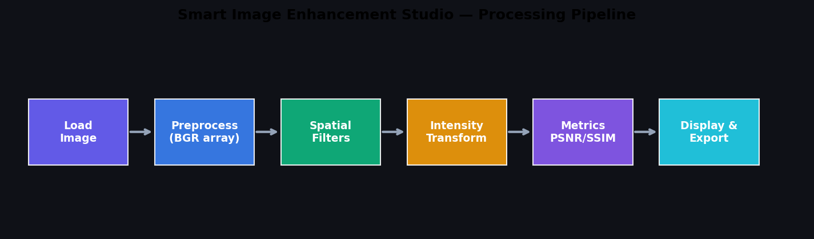
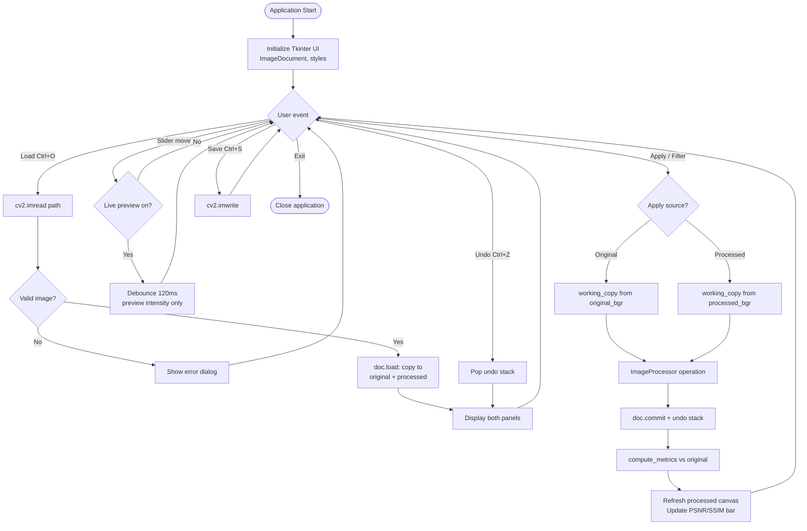
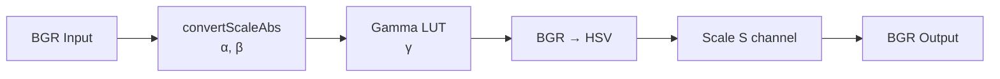
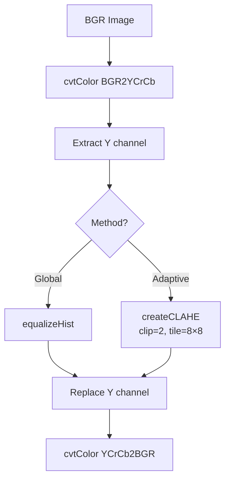
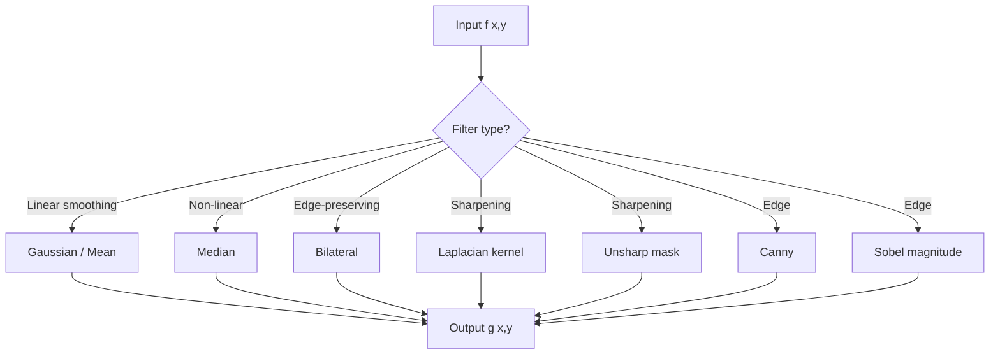
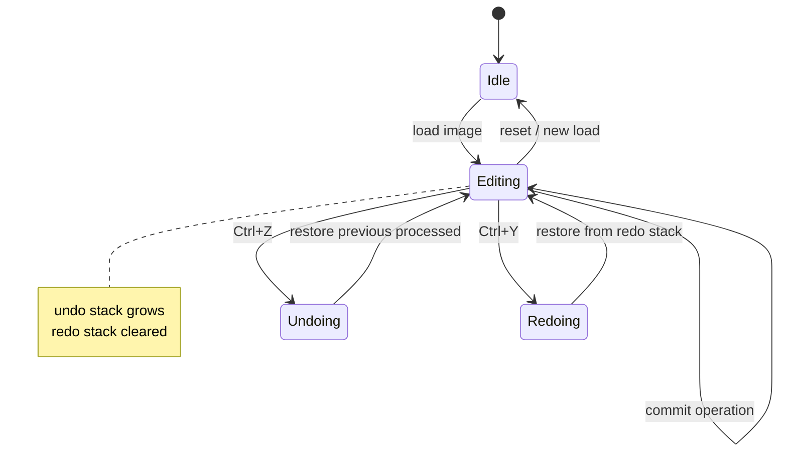
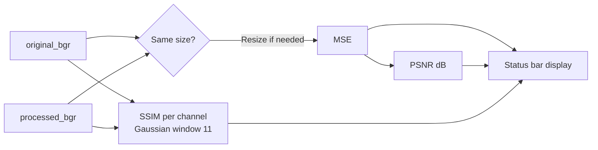

# Methodology Flowcharts & Block Diagrams
## Smart Image Enhancement Studio

Required by: **IPV Project Report Format** (§5) and **Evaluation Rubric** (methodology + workflow).

---

## 1. Overall System Pipeline

**Caption (for report):** *Figure 1 — Block diagram of the Smart Image Enhancement Studio processing pipeline from image load to export.*

---

## 2. Main Application Flowchart

---

## 3. Intensity Processing Pipeline

**Equations:**

1. \( g = \alpha f + \beta \)
2. \( s = 255 \cdot (r/255)^{1/\gamma} \)
3. \( S' = \text{clip}(s \cdot S, 0, 255) \)

---

## 4. Histogram Enhancement Pipeline

**Justification:** Chrominance (Cr, Cb) unchanged → natural colours.

---

## 5. Spatial Filtering Classification

---

## 6. Undo/Redo State Machine

---

## 7. Metrics Computation Flow

---

## 8. Step-by-Step User Process (for report §5)

| Step | Action | Technical detail |
|------|--------|------------------|
| 1 | Launch app | `python image_suite.py` |
| 2 | Load image | `cv2.imread` → BGR NumPy array |
| 3 | Choose apply source | Original or processed buffer |
| 4 | Adjust sliders / click filter | Selected `ImageProcessor` method |
| 5 | View comparison | Left = original, right = processed |
| 6 | Read metrics | PSNR, SSIM, μ, σ in status bar |
| 7 | View histogram | Matplotlib RGB plot in sidebar |
| 8 | Undo if needed | 30-level history |
| 9 | Save result | PNG/JPEG/WebP/BMP export |

---

*Export diagrams: paste Mermaid into [mermaid.live](https://mermaid.live) for PNG/SVG, or use the generated `system_pipeline.png`.*
